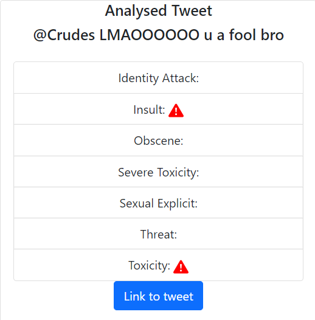

Back end for the tweet toxicity analyzer app

Try it out here: https://davage-m.github.io/Tweet-Toxicity-Front-End

Link to front end GitHub repo: https://github.com/Davage-M/Tweet-Toxicity-Front-End

This project uses the [TensorFlow.js toxicity model](https://github.com/tensorflow/tfjs-models/tree/master/toxicity).

This project uses the [Twitter API](https://developer.twitter.com/en/docs).

Example of an analyzed tweet:

